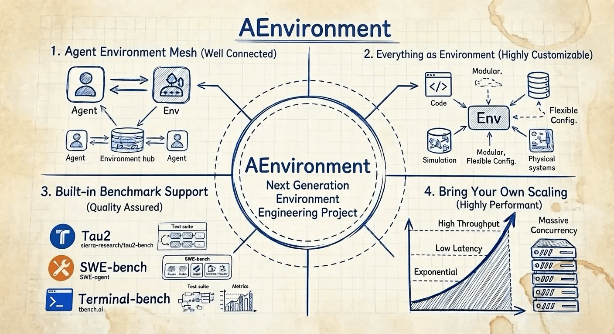

<p align="center">
  <h1 align="center">AEnvironment</h1>
  <p align="center"><b>Everything as Environmen</b> — A Production-Grade Environment Platform for Agentic RL and Agent</p>
</p>

<p align="center">
  
</p>

<p align="center">
  <a href="https://github.com/inclusionAI/AEnvironment/blob/main/LICENSE"></a>
  <a href="https://pypi.org/project/aenvironment/"></a>
  <a href="https://python.org"></a>
</p>

---

## About AEnvironment

AEnvironment is a unified environment platform for the **Agentic RL** era, built on the core philosophy of **"Everything as Environment"**. By extending standardized MCP protocol, AEnvironment provides out-of-the-box infrastructure for environment providers, algorithm developers, and agent developers, allowing them to focus on agent capabilities rather than the tedious details of environment setup.

Within Ant Group, AEnvironment serves as a key environment layer technology, deeply integrated with the AReaL reinforcement learning framework, supporting large-scale Agentic RL training and agent service deployment.

### Core Philosophy: Everything as Environment

AEnvironment abstracts everything as an environment—from simple tool functions to complex multi-agent systems, all accessible through a unified Environment interface. This unified abstraction enables capabilities to be registered, combined, and replaced like building blocks, seamlessly converging Benchmark integration, RL training, and agent deployment on the same infrastructure.

### Key Features

**🔧 Built-in Benchmarks, Zero-Cost Integration** - Ready-to-use benchmark environments with no complex configuration. Currently supported: TAU2-Bench, SWE-Bench, and Terminal-Bench.

**🚀 Seamless Agentic RL Training Integration** - With native MCP support and OpenAI Agent SDK compatibility, you can focus on agent logic and seamlessly integrate into RL training workflows.

**🤖 Agent as Environment** - Treat agents as environments, enabling multi-agent orchestration. Compatible with mainstream agent frameworks including OpenAI Agents SDK and CAMEL.

**⚡ Rapid Development to Production** - Define tools, build, and deploy in seconds. AEnvironment provides a unified, low-threshold environment API abstraction, making environments no longer a bottleneck in the training pipeline.

## Use Cases

### Mini Program IDE

Build AI-powered development environments with natural language interaction. The [Mini Program example](./aenv/examples/mini-program/) demonstrates:

- **AI Agent Integration**: Multi-turn conversations powered by OpenAI API
- **Virtual File System**: Persistent file system for managing code files
- **MCP Tools**: File operations, code execution, and validation tools
- **Live Preview**: Real-time preview of generated applications

```python
# The agent uses AEnvironment tools to create web applications
async with Environment("mini-program@1.0.0") as env:
    # Agent can use tools like read_file, write_file, execute_python_code
    result = await env.call_tool("write_file", {
        "path": "index.html",
        "content": "<html>...</html>"
    })
```


https://github.com/user-attachments/assets/23d68f94-3e10-478f-b7da-8f6ee18e47ed


📖 See [Mini Program Example](./aenv/examples/mini-program/README.md) for details.

### TAU2 RL Training

Train reinforcement learning agents with AReaL framework using TAU2 tasks. The [TAU2 RL example](./aenv/examples/tau2_rl/) shows:

- **RL Integration**: Seamless integration with AReaL for agentic RL training
- **Reward Function**: Environment exposes reward functions for RL training
- **Episode Runner**: Turn-by-turn agent execution with automatic tool invocation
- **Scalable Training**: Support for large-scale distributed RL training

```python
# Entrypoint for AReaL training
from aenv.examples.tau2_rl.agent import run_agent_return_reward

# Run a single episode and return reward
reward = await run_agent_return_reward({
    "domain": "telecom",
    "task_id": "task_123"
})
```

📖 See [TAU2 RL Example](./aenv/examples/tau2_rl/README.md) for details.

### Agent as Environment

AEnvironment uniquely supports treating agents themselves as environments. This feature makes multi-agent orchestration, hierarchical agent systems, and agent adversarial testing possible.

With Agent as Environment, you can:
- **Compose Agents**: Treat agents as reusable components that can be called like tools
- **Multi-Agent Orchestration**: Build complex workflows where agents interact with each other
- **Hierarchical Systems**: Create nested agent structures for complex problem-solving

```python
# Agent A calls Agent B as an environment
async with Environment("agent-b@1.0.0") as agent_b:
    # List available tools from Agent B
    tools = await agent_b.list_tools()

    # Call Agent B's chat tool
    response = await agent_b.call_tool("chat", {"message": "Hello!"})
    print(response.content)
```

This design enables agents to be composed and orchestrated like environments, supporting complex multi-agent scenarios where agents can interact with each other through the same unified interface.

📖 See [Agent as Environment Example](./docs/examples/agent_as_env.md) for more details.

## 🎯 Built-in Environments

AEnvironment comes with several built-in environments ready to use:

| Environment | Description | Example |
|-------------|-------------|---------|
| **TAU2** | This environment supports RL experiments with TAU2 benchmark | [tau2](./aenv/builtin-envs/tau2/) / [tau2_rl](./aenv/examples/tau2_rl/) |
| **Mini Terminal** | Lightweight terminal environment with bash command execution support | [mini-terminal](./aenv/builtin-envs/mini-terminal/) |
| **TerminalBench** | Supports running Terminal Bench evaluation | [terminalbench](./aenv/builtin-envs/terminal/) |

📖 See [Built-in Environments](./aenv/builtin-envs/) for more details.

## Quick Start

📖 For detailed setup instructions, see the [Quick Start Guide](./docs/getting_started/quickstart.md).

### Install SDK

```bash
pip install aenvironment
```

### Define Tools, Functions, and Rewards

```python
from aenv import register_tool, register_function, register_reward

# Register a tool
@register_tool
def search_code(query: str, path: str = ".") -> dict:
    """Search for code patterns in files."""
    # Implementation
    return {"matches": [...]}

# Register a function (for internal use within environment)
@register_function
def calculate_sum(a: int, b: int) -> int:
    """Calculate the sum of two numbers."""
    return a + b

# Register a reward function (for RL training)
@register_reward
def evaluate_task_completion(status: dict) -> float:
    """Evaluate task completion and return reward."""
    if status.get("completed"):
        return 1.0
    return 0.0
```

### Test the Environment

Run your environment locally to test tools:

```bash
# Start the MCP server with your tools
aenv run

# Run with tools from a specific directory
aenv run ./src
```

This will start an MCP server that exposes your tools for testing and development.

### Use Environment

```python
import asyncio
from aenv import Environment

async def main():
    async with Environment("swe-env") as env:
        # List available tools
        tools = await env.list_tools()

        # Call a tool
        result = await env.call_tool("search_code", {"query": "def main"})
        print(result.content)
        
        # Call a function (for internal use within environment)
        func_result = await env.call_function("calculate_sum", {"a": 10, "b": 20})
        print(f"Function result: {func_result}")
        
        # Call a reward function (for RL training)
        reward = await env.call_reward({"status": {"completed": True}})
        print(f"Reward: {reward}")

asyncio.run(main())
```

### CLI Usage

```bash
# Initialize a new environment project
aenv init my-env

# Build and push
aenv build && aenv push

# List remote environments
aenv list
```

## Performance

| Engine | Startup Time |
|--------|--------------|
| Kubernetes <sup>1</sup> | 6.6s |
| **Native Sandbox** <sup>2</sup> | **207ms** |
| Rock | 9.5s |
| E2B | sub-second |
| Modal | sub-second |

<sup>1</sup> Kubernetes is the currently supported engine in AEnvironment.

<sup>2</sup> Native Sandbox is a high-performance engine planned for open-source release in the future.

## 📖 Resources

- **[Installation](./docs/getting_started/installation.md)** - Installation and setup guide
- **[Quickstart](./docs/getting_started/quickstart.md)** - Get started quickly with AEnvironment
- **[SDK Guide](./docs/guide/sdk.md)** - Python SDK usage and API reference
- **[CLI Guide](./docs/guide/cli.md)** - Command-line interface documentation
- **[Environments Guide](./docs/guide/environments.md)** - Environment configuration and management
- **[Architecture](./docs/architecture/architecture.md)** - System architecture and design

## 🤝 Contributing

We warmly welcome contributions from the community! Whether you're fixing bugs, adding features, improving documentation, or helping others, your contribution is valued.

```bash
# Fork and clone the repository
git clone https://github.com/YOUR-USERNAME/AEnvironment.git
cd AEnvironment

# Install in development mode
cd aenv
pip install -e ".[dev]"

# Set up pre-commit hooks for automatic formatting
pip install pre-commit
pre-commit install

# Make changes
git checkout -b feat/your-feature
git add .
# `git commit` will automatically format your file
git commit -m "Add your feature"
git push
```

Please check our **[Contributing Guide](./CONTRIBUTING.md)** for detailed information.

### 💬 Community & Support

- **GitHub Discussions** - Ask questions, share ideas, and connect with the community
- **WeChat Group** - Join our WeChat community ([微信群](./docs/images/wechat_qrcode.png))


## License

Apache License 2.0 - see [LICENSE](./LICENSE) for details.
