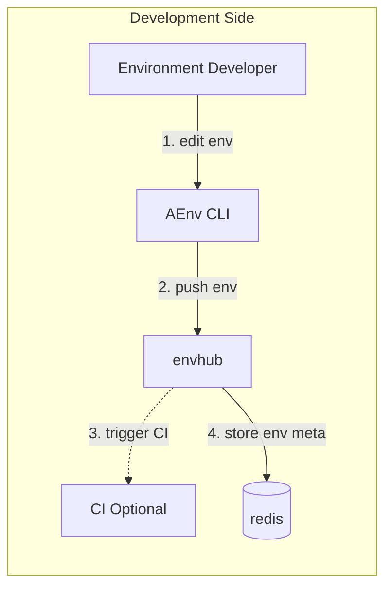
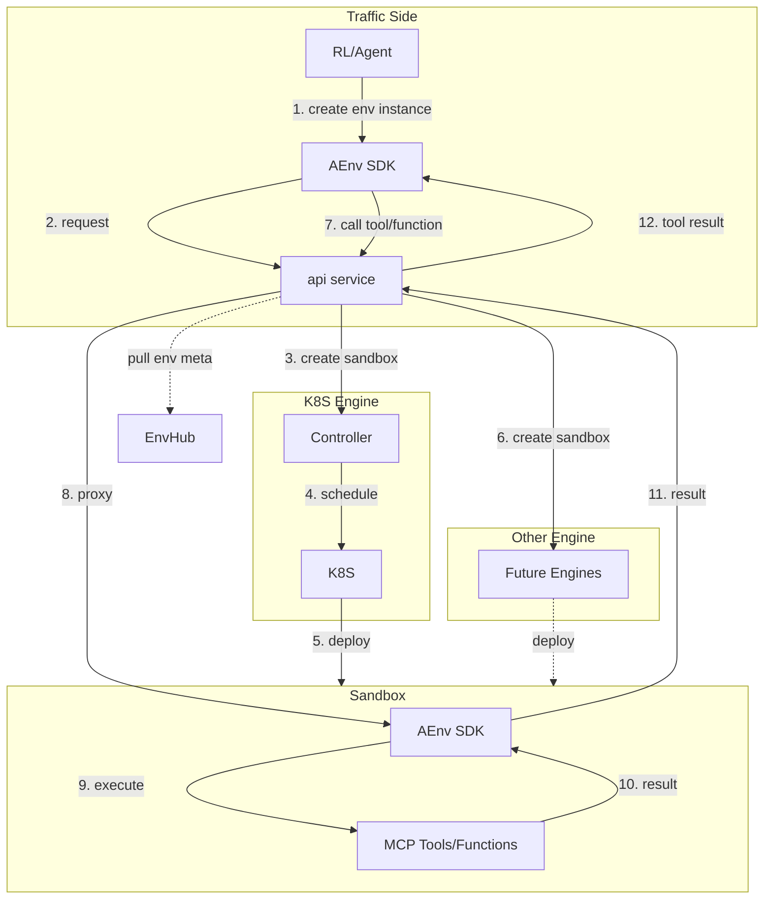
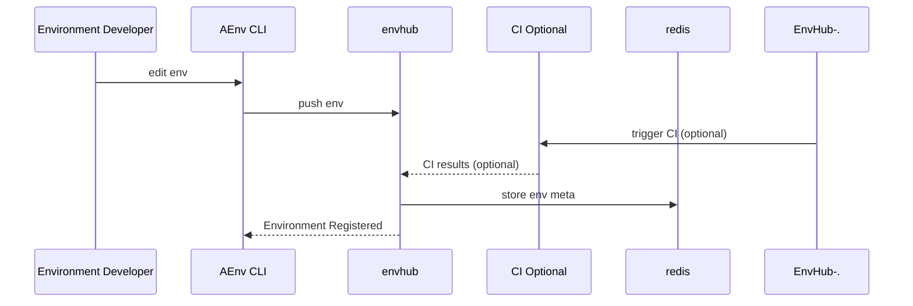
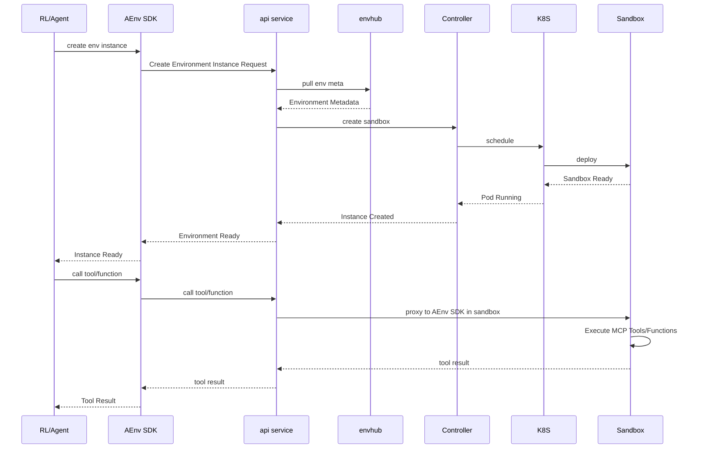
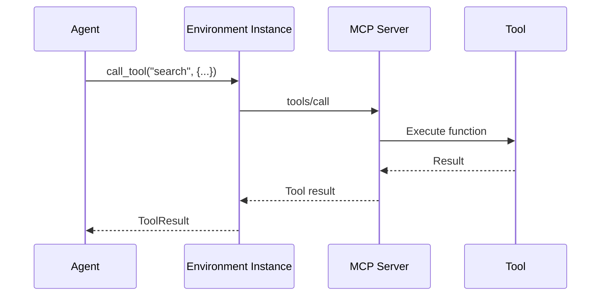
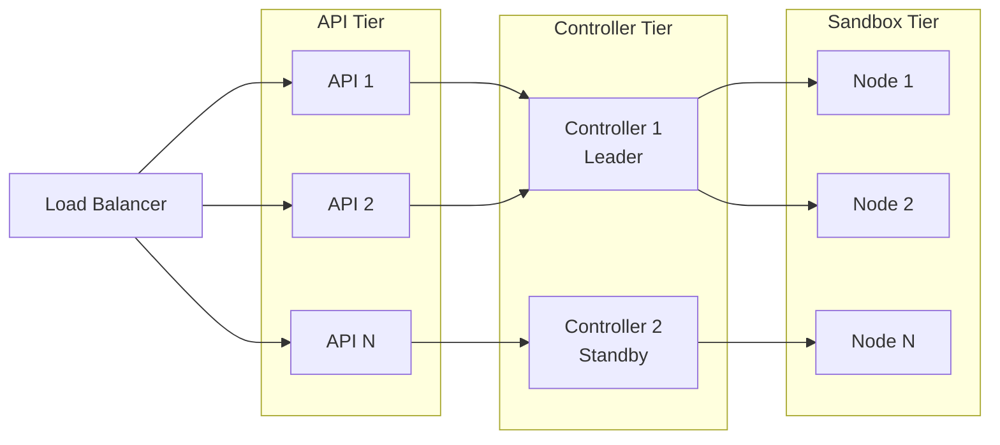
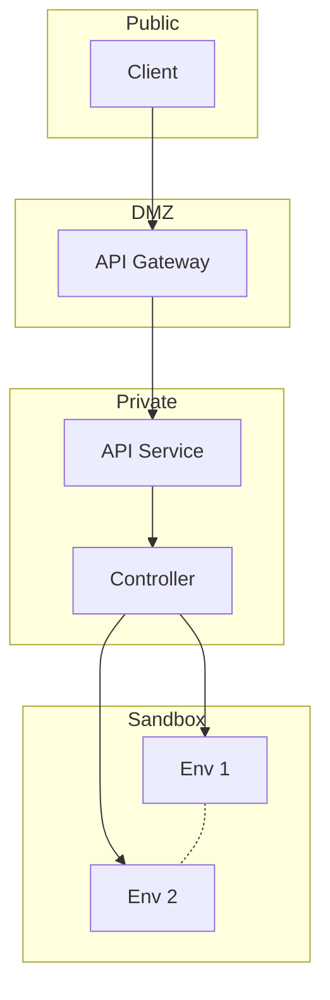
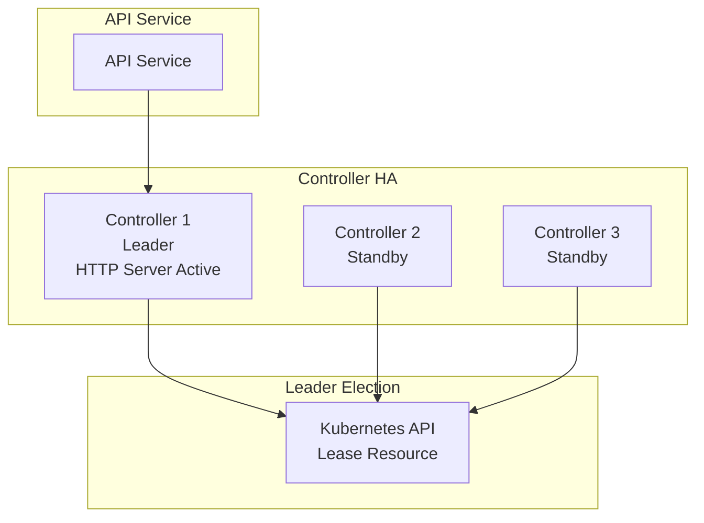

# AEnvironment Architecture

AEnvironment is a distributed platform for managing AI agent environments at scale. This document provides a comprehensive overview of the system architecture, core components, sandbox engines, and how they work together.

## System Architecture

The AEnvironment platform is divided into two main domains: **Development Side** and **Traffic Side**. The Development Side handles environment creation and metadata storage, while the Traffic Side handles runtime execution and sandbox management.

### Development Side



The Development Side handles environment definition and metadata management:

**Components:**

1. **Environment Developer**: Developer who creates and manages environments
2. **AEnv CLI**: Command-line interface for pushing environment configurations
3. **envhub**: Central registry service (EnvHub) that stores environment definitions and metadata
4. **CI (Optional)**: Optional Continuous Integration pipeline for building and testing environments
5. **redis**: Metadata storage for environment configurations

**Workflow:**

1. **Edit Environment**: Developer edits environment configuration using AEnv CLI
2. **Push Environment**: Developer pushes environment configuration to envhub via `push env` command
3. **CI Integration (Optional)**: envhub can optionally trigger CI pipeline for building and testing
4. **Metadata Storage**: envhub stores environment metadata in redis for fast retrieval

### Traffic Side



The Traffic Side handles runtime execution and sandbox orchestration:

**Components:**

1. **RL/Agent**: Reinforcement Learning agents or AI agents that use environments
2. **AEnv SDK**: Client SDK for interacting with the platform
3. **api service**: API gateway for environment instance management
4. **K8S Engine**: Kubernetes orchestration layer containing:
   - **Controller**: Manages sandbox lifecycle and scheduling
   - **K8S**: Kubernetes cluster for pod management
5. **Other Engine**: Placeholder for future sandbox engines (extensible architecture)
6. **Sandbox**: Running environment instance containing:
   - **AEnv SDK**: Runtime SDK within the sandbox
   - **MCP Tools/Functions**: Model Context Protocol tools and functions

**Workflow:**

1. **Create Environment Instance**: RL/Agent requests to create environment instance via AEnv SDK
2. **API Request**: AEnv SDK sends request to api service
3. **Metadata Retrieval**: api service pulls environment metadata from envhub
4. **Sandbox Creation**: api service requests Controller (K8S Engine) or Future Engine to create sandbox
5. **Scheduling**: Controller schedules pod creation via K8S (Controller only supports K8S)
6. **Sandbox Deployment**: K8S or Future Engine deploys the sandbox instance
7. **Tool Execution**: AEnv SDK calls tools/functions via api service (acting as proxy)
8. **Proxy Communication**: api service proxies the request to AEnv SDK within the sandbox
9. **MCP Execution**: AEnv SDK in sandbox executes MCP Tools/Functions
10. **Result Return**: Results flow back through api service proxy to the client AEnv SDK

## Sandbox Engine Architecture

AEnvironment is designed to support multiple sandbox engines through a pluggable architecture. The API Service adapts to different sandbox engines, while the Controller only supports Kubernetes.

### Sandbox Engine Interface

The API Service implements adapters for different sandbox engines:

```go
// Sandbox engine abstraction (implemented by API Service)
type SandboxEngine interface {
    Create(ctx context.Context, spec *SandboxSpec) (*SandboxInstance, error)
    Delete(ctx context.Context, instanceID string) error
    Get(ctx context.Context, instanceID string) (*SandboxInstance, error)
    List(ctx context.Context) ([]*SandboxInstance, error)
    Watch(ctx context.Context) (<-chan SandboxEvent, error)
}

// API Service adapts to different engines
type APIService struct {
    k8sEngine    *K8SEngineAdapter      // Uses Controller for K8S
    nativeSandboxEngine *NativeSandboxEngineAdapter
    e2bEngine    *E2BEngineAdapter
    rayEngine    *RayEngineAdapter
}
```

### Current Implementation: Kubernetes

**Kubernetes** is the current production sandbox engine. It provides:

- **Container Orchestration**: Native Kubernetes pod management
- **Resource Management**: CPU, memory, GPU allocation
- **Scaling**: Horizontal and vertical scaling capabilities
- **High Availability**: Built-in redundancy and failover
- **Networking**: CNI-based networking and service mesh support

**Architecture:**
```
Kubernetes Sandbox
├── Pod Management      # Create, get, list, delete pods
├── Template System     # Pod templates for consistent configs
├── State Cache         # In-memory pod state cache
└── Watch API           # Real-time pod state updates
```


## Core Components

### API Service

The API Service is the entry point for all client requests, providing a unified interface to the platform.

**Key Features:**
- **REST API**: Standard HTTP endpoints for environment management
- **MCP Gateway**: Model Context Protocol support for tool communication
- **Sandbox Engine Adaptation**: Adapts to different sandbox engines (K8S via Controller, Native Sandbox, E2B, Ray, etc.)
- **Proxy Communication**: Acts as proxy between client AEnv SDK and AEnv SDK in sandbox
- **Authentication**: API key and token-based authentication
- **Rate Limiting**: Request throttling and quotas
- **Instance Management**: Environment lifecycle operations

**Architecture:**
```
api-service/
├── controller/     # Request handlers (env instances, MCP proxy)
├── middleware/     # Auth, logging, rate limiting, metrics
├── models/         # Data models
└── service/        # Business logic (backend client, scheduler client)
```

**Endpoints:**
- `POST /env-instance` - Create a new environment instance
- `GET /env-instance/:id/list` - List instances for a user
- `GET /env-instance/:id` - Get instance details
- `DELETE /env-instance/:id` - Delete an instance
- `GET /health` - Health check
- `GET /metrics` - Prometheus metrics

**Ports:**
- `:8080` - Main API server
- `:8081` - MCP Gateway

**Middleware Stack:**
- Authentication middleware (token validation with caching)
- Rate limiting middleware (QPS throttling)
- Instance limit middleware (per-user limits)
- Logging middleware (structured logging)
- Metrics middleware (Prometheus metrics)

### Controller

The Controller manages environment lifecycle and interacts with the Kubernetes sandbox engine. **Note: The Controller only supports Kubernetes engine.** For other sandbox engines (Native Sandbox, E2B, Ray, etc.), the API Service directly adapts to them.

**Key Features:**
- **Kubernetes Integration**: Direct integration with Kubernetes for pod management
- **Pod Management**: Create, get, list, and delete pods (Kubernetes only)
- **Pod Template Management**: Load and apply pod templates
- **State Tracking**: Cache and track instance status
- **Leader Election**: High availability with Kubernetes leader election

**Architecture:**
```
controller/
├── cmd/               # Entry points
├── controllers/       # Kubernetes controllers
├── pkg/
│   ├── aenvhub_http_server/  # HTTP server and pod handlers
│   ├── http_server/          # Pod template utilities
│   └── model/                # Data models
└── deploy/
    └── pod_templates/ # Pod template definitions
```

**Endpoints:**
- `POST /pods` - Create a new pod
- `GET /pods` - List pods
- `GET /pods/{podName}` - Get pod details
- `DELETE /pods/{podName}` - Delete a pod

**Port:** `:8080`

**Kubernetes Integration:**

The Controller directly uses the Kubernetes client-go library for pod management:

```go
// Controller only supports Kubernetes
type Controller struct {
    clientset kubernetes.Interface
    podCache  *PodCache
    templates *TemplateManager
}

func (c *Controller) CreatePod(spec *PodSpec) (*Pod, error) {
    // Create pod via Kubernetes API
    pod, err := c.clientset.CoreV1().Pods(spec.Namespace).Create(ctx, spec.PodSpec, metav1.CreateOptions{})
    if err != nil {
        return nil, err
    }
    
    // Track in cache
    c.podCache.Add(pod)
    
    return pod, nil
}
```

**Note:** The Controller is Kubernetes-specific. For other sandbox engines (Native Sandbox, E2B, Ray, etc.), the API Service directly integrates with them and adapts to their specific APIs.

### EnvHub

EnvHub is the central registry for environment definitions and container images.

**Key Features:**
- **Environment Registry**: Store and retrieve environment definitions
- **Image Management**: Container image storage and distribution
- **Version Control**: Semantic versioning and version history
- **Discovery**: Search and browse available environments

**Architecture:**
```
envhub/
├── controller/    # API handlers
├── service/       # Registry operations
├── models/        # Data models
└── clients/       # External service clients
```

**API Endpoints:**
- `GET /api/v1/environments` - List environments
- `GET /api/v1/environments/{name}` - Get environment details
- `POST /api/v1/environments` - Push new environment
- `DELETE /api/v1/environments/{name}` - Delete environment
- `GET /api/v1/environments/{name}/versions` - Get version history

## Data Flow

### Development Side Flow



### Traffic Side Flow



### Tool Execution Flow



## Sandbox Engine Configuration

### Kubernetes Configuration

**Pod Templates:**

The Controller supports two pod template types: **Single Container** (default) and **Dual Container**. Templates are configured in `deploy/controller/values.yaml` under the `podTemplates` section.

**Single Container Template (Default):**

The single container template is the default configuration. It creates pods with a single container running the environment:

```yaml
# From deploy/controller/values.yaml - podTemplates.singleContainer
apiVersion: v1
kind: Pod
metadata:
  name: placeholder
  namespace: {{ .Values.sandboxNamespace }}
  labels:
    app.kubernetes.io/name: aenv-sandbox
    template-type: singleContainer
spec:
  containers:
  - name: main
    image: weather:v0.1.0
    imagePullPolicy: IfNotPresent
    resources:
      limits:
        cpu: "2"
        memory: "4Gi"
        ephemeral-storage: "10Gi"
      requests:
        cpu: "1"
        memory: "2Gi"
        ephemeral-storage: "5Gi"
    livenessProbe:
      httpGet:
        path: /health
        port: 8081
        scheme: HTTP
    env:
    - name: AENV_TYPE
      value: "singleContainer"
  restartPolicy: Never
```

**Dual Container Template:**

The dual container template creates pods with two containers: a main container and a sidecar container. This is useful for scenarios requiring additional services or shared storage:

```yaml
# From deploy/controller/values.yaml - podTemplates.dualContainer
apiVersion: v1
kind: Pod
metadata:
  name: placeholder
  namespace: {{ .Values.sandboxNamespace }}
  labels:
    app.kubernetes.io/name: aenv-sandbox
    template-type: dualContainer
spec:
  containers:
  - name: main
    image: aenv-base:latest
    # Main container configuration
    volumeMounts:
    - mountPath: /shared
      name: shared-data
  - name: second
    image: aenv-sidecar:latest
    # Sidecar container configuration
    volumeMounts:
    - mountPath: /shared
      name: shared-data
  volumes:
  - name: shared-data
    emptyDir: {}
  restartPolicy: Never
```

**Template Selection:**

- By default, the single container template is used
- The template type can be specified in the environment creation request, which comes from the `aenvironment config.json` file
- Templates are loaded from the ConfigMap mounted at `/etc/aenv/pod-templates/`

**Controller Configuration:**

```bash
controller \
  --namespace aenv \
  --server-port 8080 \
  --metrics-addr :8088 \
  --leader-elect true \
  --qps 50 \
  --burst 100
```

## Deployment Modes

AEnvironment supports multiple deployment modes for different use cases:

### Kubernetes Mode

Production deployment on Kubernetes clusters with high availability and scalability.

**Key Features:**
- High availability with leader election
- Horizontal scaling support
- Production-ready configuration
- Helm chart-based deployment

For detailed deployment instructions, see [Deployment Guide](../getting_started/deployment.md).

**Quick Start:**

```bash
helm install aenv-platform ./deploy \
  --namespace aenv \
  --create-namespace \
  --wait \
  --timeout 10m
```

### Docker Compose Mode (TODO)

Single-node deployment for development and testing using Docker Compose.

**Planned Features:**
- Quick local setup
- All components in one stack
- Suitable for development and testing
- Easy to start/stop

### Other Deployment Modes (TODO)

Additional deployment options planned for future releases:

- **Cloud Provider Managed Services**: AWS ECS, Azure Container Instances, GCP Cloud Run
- **Serverless Mode**: Function-as-a-Service deployment
- **Edge Deployment**: Lightweight deployment for edge computing scenarios

## Scalability

### Horizontal Scaling



## Security

### Network Isolation



### Authentication & Authorization

- **API Keys**: Service-to-service authentication
- **Namespace Isolation**: Multi-tenant separation

## Observability

### Metrics

All components expose Prometheus metrics:

| Component | Key Metrics |
|-----------|-------------|
| **API Service** | Request rate, latency, error rate, active instances |
| **Controller** | Pod operations, cache size, sandbox engine calls |
| **EnvHub** | Push/pull duration, cache hits, registry errors |

## High Availability

### Controller Leader Election



**Features:**
- Leader election via Kubernetes Lease resource
- Automatic failover when leader becomes unavailable
- Multiple replicas for redundancy
- Only leader instance serves HTTP requests

## Future Enhancements

### Planned Sandbox Engines

The architecture supports adding additional sandbox engines such as:

- **Native Sandbox**: High-performance container runtime for fast startup and execution
- **E2B**: Secure cloud development environments with isolated sandboxes
- **Ray**: Distributed computing framework for scalable AI workloads
- **Container Runtimes**: Docker, containerd, CRI-O
- **VM-based Sandboxes**: Firecracker, Kata Containers

Each sandbox engine implements the `SandboxEngine` interface and can be configured via the API Service. The API Service adapts to different engines, while the Controller only supports Kubernetes.

### Sandbox Engine Features

- **Auto-scaling**: Dynamic scaling based on demand
- **Resource Optimization**: Intelligent resource allocation
- **Multi-tenancy**: Enhanced isolation between tenants

## Future Plans

The following features are planned for future releases:

### Observability Enhancements

#### Logging

Real-time log streaming from sandbox execution environments:

**Features:**
- **Stream Logs**: Real-time log streaming from running sandbox instances
- **Structured Logging**: JSON-formatted logs with correlation IDs for request tracing
- **Log Aggregation**: Centralized log collection from all sandbox instances
- **Log Query**: Search and filter logs by instance ID, correlation ID, timestamp, and log level

**Log Format:**

```json
{
  "timestamp": "2025-01-15T10:30:00Z",
  "level": "info",
  "message": "Tool execution completed",
  "instance_id": "env-instance-123",
  "env_name": "swe-env",
  "sandbox_engine": "kubernetes",
  "correlation_id": "abc-123",
  "tool_name": "search",
  "duration_ms": 150,
  "stdout": "Search results: ...",
  "stderr": ""
}
```

**API Endpoints:**
- `GET /env-instance/:id/logs` - Stream logs from a specific sandbox instance
- `GET /env-instance/:id/logs?follow=true` - Follow logs in real-time (streaming)
- `GET /env-instance/:id/logs?tail=100` - Get last N lines of logs

#### Distributed Tracing

OpenTelemetry support for end-to-end request tracing across all components and sandbox engines.

### Authentication & Authorization Enhancements

- **JWT Tokens**: User authentication support
- **RBAC**: Role-based access control for fine-grained permission management

