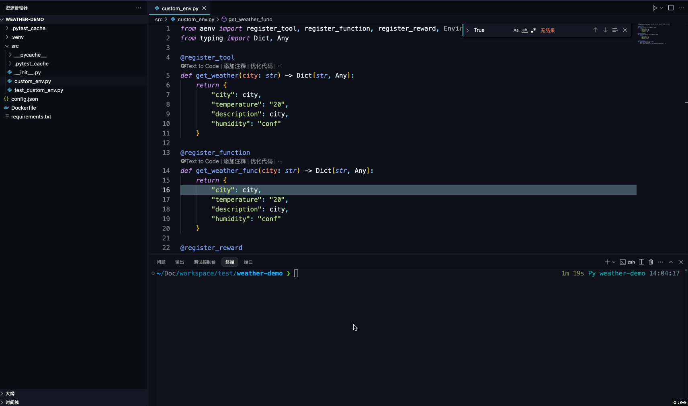
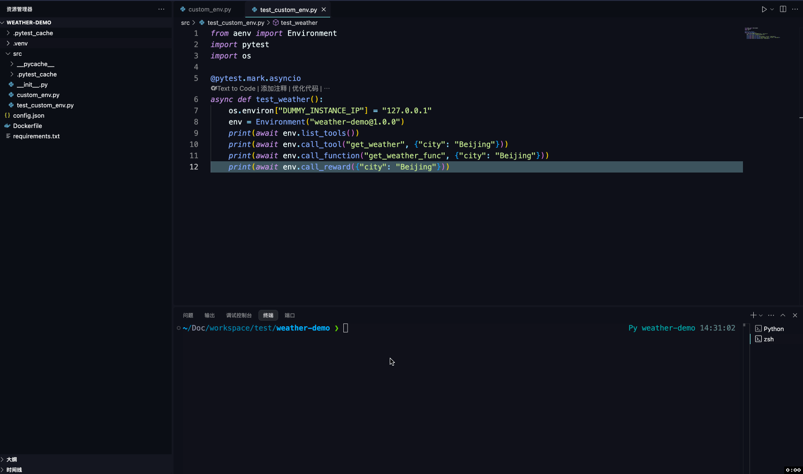
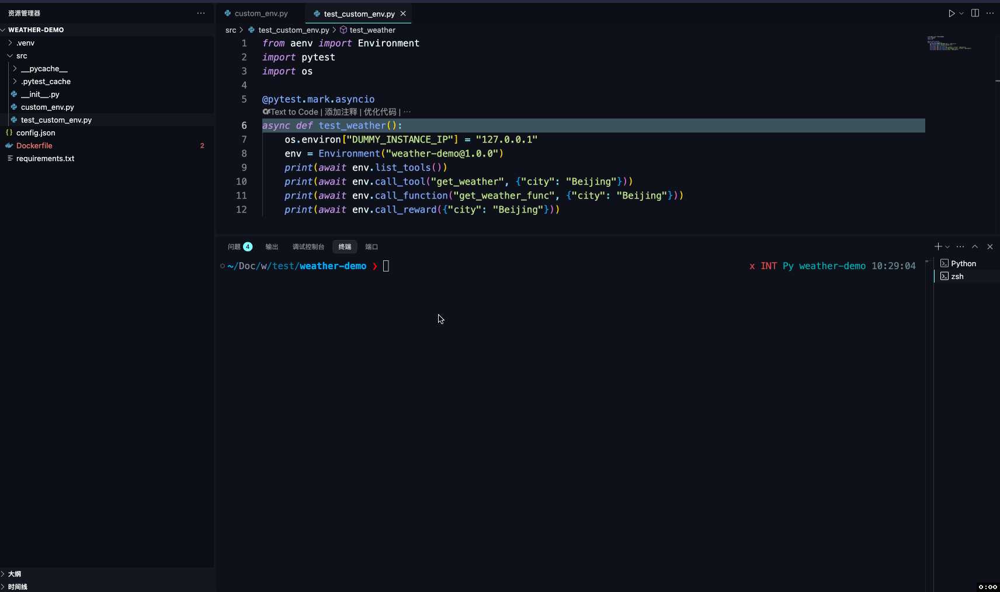
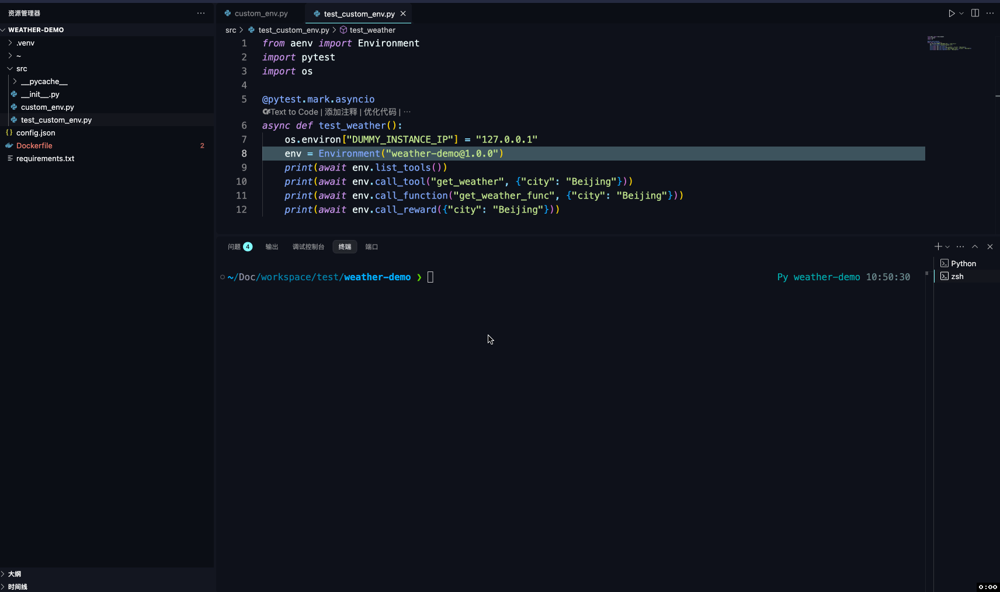

# Example: Weather Environment
## Overview
This example will show you:
1. How to create a simple custom environment that implements the standard MCP protocol
2. How to locally test this environment
3. How to publish this environment to `EnvHub`
4. How to pull and use this environment from `EnvHub`

## Requirements
* `Python >= 3.12`: Python-based runtime environment
* `AEnvironment`: aenv SDK
* `Docker`: used to package the `Weather` environment into an image
```bash
pip install aenvironment
```

## Development Environment
### Initialization
```bash
aenv init weather-demo
```
You will create a new `weather` project with the following structure:
```
Dockerfile
├── config.json
├── requirements.txt
├── src
    ├── __init__.py
    ├── custom_env.py
```
* `Dockerfile`: Default image build script for AEnv releases, based on a base Ubuntu image that includes the aenvironment
* `requirements.txt`: Dependencies required by the environment
* `custom_env.py`: Custom environment business logic

### Activate venv
Prepare a virtual environment for our new project:
```bash
cd weather-demo
python -m venv .venv
source .venv/bin/activate
pip install -r requirements.txt
```

### Add MCP Tools
Just add the `@register_tools` decorator to your Python function to create a standard `mcp tool` method:
```python
from aenv import register_tool

@register_tool
def get_weather(city: str) -> Dict[str, Any]:
    return {
        "city": city,
        "temperature": "20",
        "description": city,
        "humidity": "conf"
    }
```

### Add Function Tools
Similarly, add the `@register_function` decorator to expose a standard function:
```python
from aenv import register_function

@register_function
def get_weather_func(city: str) -> Dict[str, Any]:
    return {
        "city": city,
        "temperature": "20",
        "description": 2city,
        "humidity": "conf"
    }
```

### Add Reward
How to define a model reward function? `register_reward` is what you need:
```python
from aenv import register_reward
@register_reward
def is_good_weather(city: str) -> bool:
    result = get_weather(city)
    return result["temperature"] > 15 and result["temperature"] < 30
```

Congratulations! You have completed the development of a `weather` environment!

## Test Environment

Run the following command. `aenv` will start up the environment locally as an `MCP Server` and install `MCP Inspector` for testing; it uses port `8081` by default:
```bash
# Run this command in your project directory (e.g., weather-demo)
aenv run
```


It is recommended to use `pytest` and `pytest-asyncio` to run unit tests asynchronously.
```bash
pip install pytest
pip install pytest-asyncio
```

### Add UnitTest
Add a test file `test_custom_env.py`:
* Use the environment variable `DUMMY_INSTANCE_IP` to direct requests to the local `MCP Server` started via `aenv run`
* Use `list_tools`, `call_tool`, `call_function`, and `call_reward` to invoke the methods created in the environment
```python
from aenv import Environment
import pytest
import os

@pytest.mark.asyncio
async def test_weather():
    os.environ["DUMMY_INSTANCE_IP"] = "127.0.0.1"
    env = Environment("weather-demo@1.0.0")
    print(await env.list_tools())
    print(await env.call_tool("get_weather", {"city": "Beijing"}))
    print(await env.call_function("get_weather_func", {"city": "Beijing"}))
    print(await env.call_reward({"city": "Beijing"}))
```
Run:
```bash
pytest -s src/test_custom_env.py
```


## Publish Environment
Publishing the environment includes three steps: packaging the image, configuring the backend service, and pushing the image.

### Package Image
Ensure your local docker  service is running:
```bash
docker info
```
Run the following command to build and push the image to the target registry:
```bash
aenv build --push
```
After the image is built, you can verify the image output via `docker images` and the `artifacts` field in `config.json` under the project directory.


### Configure Backend Service (EnvHub)
To use the environment in a production cluster, you need to publish it to a deployed `EnvHub` backend service. For backend deployment, refer to [Deployment Guide](../getting_started/deployment.md).

Assume we have deployed a k8s environment locally using `minikube`, where the `EnvHub` service address is `http://localhost:8083`:
```
aenv config set hub_backend http://localhost:8083/
```

### Push Environment
Run the following command to upload the env metadata to `EnvHub`:
```bash
# Push environment information
aenv push
# Retrieve environment
aenv get weather-demo
# Filter list
aenv list | grep weather-demo
```


## Use Environment

### Configure API Service
In production, to use environments from `EnvHub`, you must call the `api service` to initiate remote requests. For deploying `api service`, refer to [Deploying api service on a k8s Cluster](../getting_started/installation.md).

Assume we have deployed a simple environment locally using `minikube`, where the `api service` address is `http://localhost:8080` and the `MCP` request forwarding address is `http://localhost:8081`.

### Use Environment

Add business logic in `run_custom_env.py`:
* Use the environment variable `AENV_SYSTEM_URL` to specify a custom `api service` address
* Use `list_tools`, `call_tool`, `call_function`, and `call_reward` to invoke the methods created in the environment
* Call the `release` method after use to ensure the remote instance is properly released
```python
import time
from aenv import Environment
import os
import asyncio

async def main():
    # Specify api service address
    os.environ["AENV_SYSTEM_URL"] = "http://localhost"
    # Create environment instance
    env = Environment("weather-demo@1.0.0", timeout=60)
    try:
        # Make tool calls
        print(await env.list_tools())
        print(await env.call_tool("get_weather", {"city": "Beijing"}))
        print(await env.call_function("get_weather_func", {"city": "Beijing"}))
        print(await env.call_reward({"city": "Beijing"}))
    except Exception as e:
        print("An error occurred:", e)
    finally:
        time.sleep(10)
        # Destroy instance
        await env.release()

asyncio.run(main())
```
Run the code:
```bash
python run run_custom_env.py
```

Observe environment creation and destruction in `minikube`:
```bash
kubectl get pod -n aenvsandbox
```

