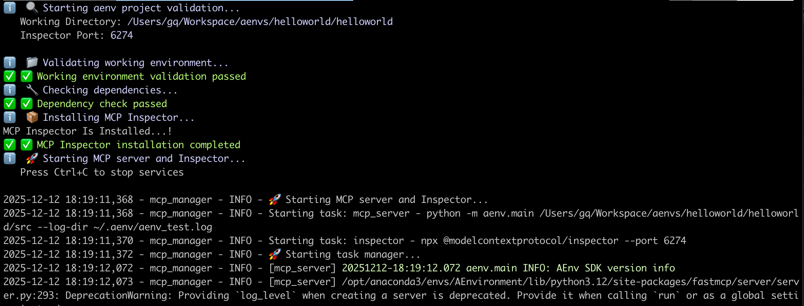
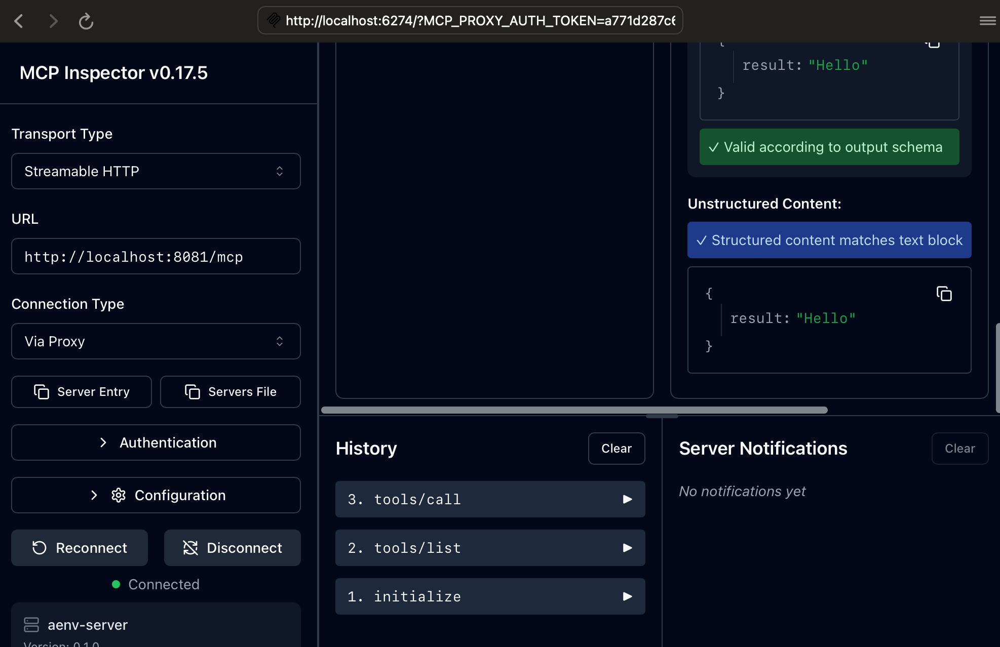
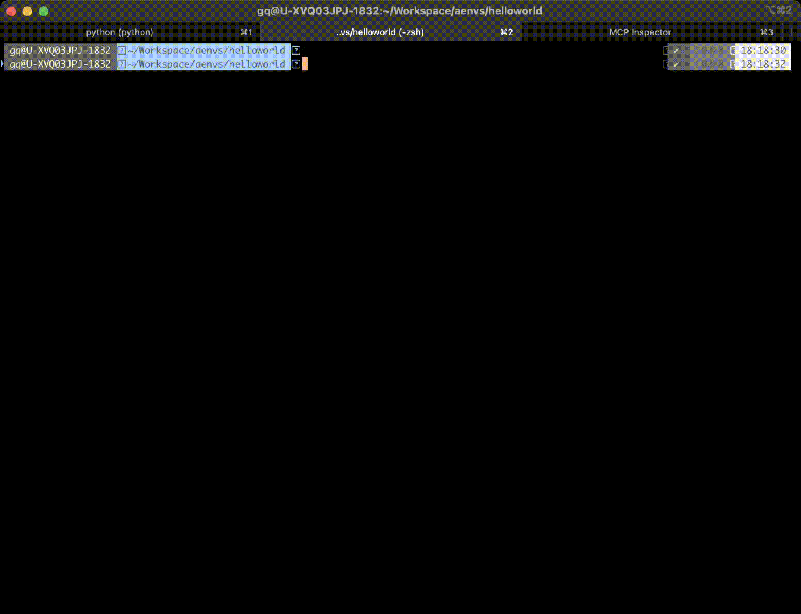

# Quick Start Guide

> Get started with AEnvironment in 5 minutes - complete workflow from environment creation to cloud deployment

## AEnvironment Overview

AEnvironment is a revolutionary **Environment-as-Code** development framework designed for modern AI applications and reinforcement learning training scenarios. Define reusable intelligent environments using native Python syntax with perfect MCP (Model Context Protocol) support and one-click cloud deployment.

## 🚀 5-Minute Quick Start

### Step 1: Environment Initialization

Use the AEnvironment CLI tool to quickly create your first environment:

```bash
# Create project directory
mkdir my-aenv-project && cd my-aenv-project

# Initialize environment template
aenv init helloworld
```

#### Project Structure Analysis

After initialization, you'll get a standard AEnvironment project structure:

```text
helloworld/                    # Project root directory
├── 📄 config.json            # Environment configuration file
├── 🐳 Dockerfile             # Container build file
├── 📋 requirements.txt       # Python dependencies list
└── 📁 src/                   # Source code directory
    ├── __init__.py          # Package initialization file
    └── custom_env.py        # Custom environment logic
```

> **💡 Tip**: The scaffolding has generated a complete basic template for you to start development immediately

### Step 2: Implement Custom Logic

Edit the `src/custom_env.py` file to implement your environment functionality:

```python
from typing import Any, Dict
from aenv import register_tool, register_reward

@register_tool
def echo_tool(content: str) -> Dict[str, Any]:
    """
    Intelligent echo tool - demonstrates basic tool development
    
    Function: Receives any input content and returns structured response
    
    Parameters:
        content: Text content to echo
        
    Returns:
        Dictionary containing original content and processing results
    """
    return {
        "original_content": content,
        "processed_content": f"🎯 Processing result: {content}",
        "timestamp": "2024-12-12T17:30:00Z"
    }

@register_reward
def simple_reward(task: str) -> Dict[str, Any]:
    """
    Basic reward function - demonstrates reward mechanism implementation
    
    Function: Provides standardized feedback for task execution
    
    Parameters:
        task: Task description
        
    Returns:
        Reward information including score and feedback
    """
    return {
        "task_name": task,
        "status": "success",
        "score": 1.0,
        "feedback": f"✅ Task '{task}' executed successfully",
        "metadata": {"execution_time": 0.1}
    }
```

> **🔧 Extension Guide**: To add dependencies or custom build logic, modify `requirements.txt` and `Dockerfile`

### Step 3: Local Testing

Start the local testing environment from the project root directory (containing config.json file):

```bash
# Enter project directory
cd helloworld

# Start local environment (includes MCP server and debugging interface)
aenv run
```

#### Startup Process Logs



#### Debug Interface Preview

After successful startup, the system will automatically open the MCP Inspector debugging interface where you can:

- 🔍 **Tool Testing**: Directly call registered tools
- 📊 **Real-time Monitoring**: View tool execution status and results
- 🎯 **Interactive Debugging**: Test different parameter combinations


### Step 4: Build Environment Image

After local testing, build the environment into a deployable Docker image:

```bash
# Build environment image
aenv build

# Build and push to image registry (requires registry configuration)
aenv build --push
```

#### Build Process

```text
📦 Building environment image...
├── 🐳 Building Docker image: hello:1.0.0
├── 🔍 Running test suite: pytest tests/
├── ✅ All tests passed
└── 🚀 Image build complete
```

> **🔐 Image Push**: To push to a private registry, ensure registry authentication is configured

### Step 5: Publish to Hub

Publish environment metadata to AEnvironment Hub for cloud sharing:

```bash
# Publish environment to registry
aenv push

# View publish results
aenv get hello --version 1.0.0
```

#### Environment Metadata Example

```json
{
  "id": "hello-1.0.0",
  "name": "hello",
  "description": "AEnvironment getting started example environment",
  "version": "1.0.0",
  "tags": ["getting-started", "example", "Python"],
  "artifacts": [
    {
      "type": "image",
      "content": "hello:1.0.0"
    }
  ],
  "build_config": {
    "dockerfile": "./Dockerfile"
  },
  "deploy_config": {
    "cpu": "1",
    "memory": "2G",
    "os": "linux"
  }
}
```

### Development Workflow



## 🎯 Environment Usage Guide

### Local Mode

#### Environment Configuration

| Environment Variable | Description | Default Value |
|---------------------|-------------|---------------|
| `DUMMY_INSTANCE_IP` | Local MCP service address | `http://localhost:8081` |

#### Usage Example

```python
import asyncio
from aenv import Environment

async def local_usage():
    # Connect to local environment
    async with Environment("helloworld") as env:
        # Discover available tools
        tools = await env.list_tools()
        print(f"🔧 Available tools: {[t.name for t in tools]}")
        
        # Call custom tool
        result = await env.call_tool(
            "echo_tool",
            {"content": "Hello from AEnvironment!"}
        )
        print(f"📤 Tool response: {result.content}")

# Run example
if __name__ == "__main__":
    asyncio.run(local_usage())
```

### Cloud Production Mode

#### Environment Configuration

| Environment Variable | Description | Example |
|---------------------|-------------|---------|
| `AENV_SCHEDULER_URL` | AEnvironment platform address | `https://aenv.your-company.com` |
| `AENV_API_KEY` | API authentication key | `sk-xxx...xxx` |
| `AENV_TIMEOUT` | Request timeout | `30` |

#### Usage Example

```python
import asyncio
import os
from aenv import Environment

async def cloud_usage():
    # Create cloud environment instance
    async with Environment("helloworld@1.0.0", timeout=60) as env:
        # Cloud environment auto-initializes
        tools = await env.list_tools()
        print(f"☁️ Cloud tools: {[t.name for t in tools]}")
        
        # Execute cloud task
        result = await env.call_tool(
            "echo_tool",
            {"content": "Hello from Cloud!"}
        )
        print(f"🚀 Cloud response: {result.content}")

if __name__ == "__main__":
    asyncio.run(cloud_usage())
```

## 🚀 Next Steps

After completing the quick start, we recommend the following learning path:

### 📚 Learning Path

1. **Core Concepts** - {doc}`concepts` - Deep dive into AEnvironment architecture design
2. **SDK Guide** - {doc}`../guide/sdk` - Master advanced Python SDK usage

---

<div align="center">

**🎉 Congratulations!** You have successfully created and deployed your first AEnvironment

[Deep Dive into Core Concepts →](concepts.md)

</div>

