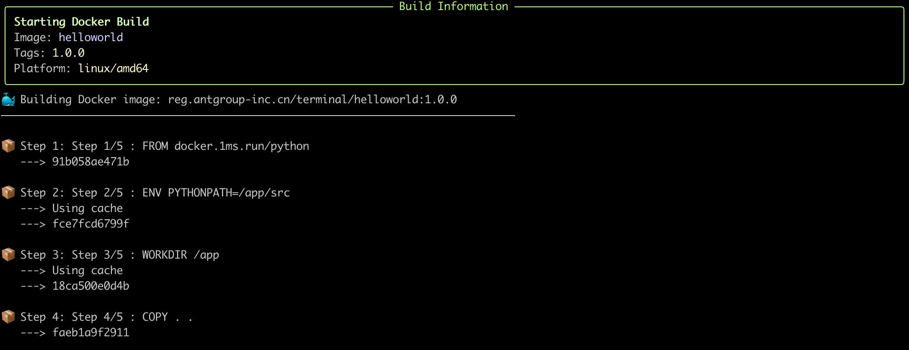

# AEnvironment CLI User Guide

This guide provides comprehensive documentation for all AEnvironment CLI commands and features, helping you efficiently manage AEnvironment projects and environments.

## 📋 Command Overview

```text
Usage: aenv [OPTIONS] COMMAND [ARGS]...

  Aenv CLI helps build your custom aenv

Options:
  --debug
  -v, --verbose  Enable verbose output
  --help         Show this message and exit.

Commands:
  build    Build Docker images with real-time progress display.
  config   Manage CLI configuration.
  get      Get specified environment details
  init     Initialize aenv project using environmental scaffolding tools
  list     List all environments with pagination
  push     Push current aenv project to remote backend aenv hub
  release  Release current aenv project
  test     Test current aenv project by running local directly
  version  Display version number and corresponding build/commit information
```

| Command Category | Command | Description |
|---|---|---|
| **Project Lifecycle** | `init` | Initialize new project |
| | `build` | Build container images |
| | `run` | Validate environment configuration |
| | `push` | Push environment to repository |
| **Environment Management** | `list` | List all environments |
| | `get` | Get environment details |
| **Configuration Management** | `config` | Manage CLI configuration |
| **System Information** | `version` | Display version information |

## 🚀 Quick Start

### Typical Workflow

```bash
# 1. Create new project
aenv init my-search-env --template default

# 2. Validate configuration
aenv run --work-dir ./my-search-env

# 3. Build image
aenv build --work-dir ./my-search-env --image-tag v1.0.0

# 4. Push to repository
aenv push --work-dir ./my-search-env --version 1.0.0

# 5. Release environment
aenv release --work-dir ./my-search-env
```

## 🛠️ Project Lifecycle Commands

### `aenv init` - Initialize Project

Create a new AEnvironment project with support for multiple templates.

#### Basic Usage

```text
Usage: aenv init [OPTIONS] NAME

  Initialize aenv project using scaffolding tools

  NAME: aenv name

  Examples:
    aenv init myproject --version 1.0.0
    aenv init myproject --template default --work-dir ./myproject --force

Options:
  -v, --version TEXT        Specify aenv version number
  -t, --template [default]  Scaffolding template selection
  -w, --work-dir TEXT       Working directory for initialization
  --force                   Force overwrite existing directory
  --help                    Show this message and exit.
```

#### Available Templates
| Template Name | Description | Use Cases |
|---|---|---|
| `default` | Basic template | General environments |

#### Project Structure
```
my-project/
├── config.json          # Environment configuration
├── Dockerfile          # Container definition
├── requirements.txt    # Python dependencies
├── src/               # Source code
│   ├── __init__.py
│   └── custom_env.py
├── test/              # Test files
└── README.md          # Project documentation
```

- **config.json**: Defines environment metadata including build configuration, test scripts, deployment resource requirements, and version information

<details>
<summary>Configuration Example</summary>

```json
{
  "name": "r2egym-couple-env",
  "version": "1.0.0",
  "tags": ["swe", "python", "linux"],
  "status": "Ready",
  "codeUrl": "oss://xxx",
  "artifacts": [],
  "buildConfig": {
    "dockerfile": "./Dockerfile"
  },
  "testConfig": {
    "script": "pytest xxx"
  },
  "deployConfig": {
    "cpu": "1C",
    "memory": "2G",
    "os": "linux",
    "imagePrefix": "reg.example.com/areal_agent/image",
    "podTemplate": ""
  }
}
```
</details>

- **Dockerfile**

The final deliverable is primarily a container image, with the Dockerfile defining base configuration, dependency installation, and environment variable setup.

- **src**

Environment business logic code is placed in the src directory. Use `@register` decorators to register code as corresponding tools, functions, and rewards.

### `aenv run` - Validate Environment

After code development, use the run command for local validation.

#### Basic Usage

<details>
<summary>Usage Details</summary>

```text
Usage: aenv run [OPTIONS]

  Test current aenv project by running local directly

  Examples:
    aenv run --work-dir /tmp/aenv/search

Options:
  --work-dir TEXT           Specify aenv development root directory
  --inspector-port INTEGER  MCP Inspector port
  --help                    Show this message and exit.
```
</details>

```bash
# Validate current directory
aenv run

# Specify working directory
aenv run --work-dir ./my-project
```

<details>
<summary>Output Example</summary>

```text
ℹ️  🔍 Starting aenv project validation...
   Working Directory: /AEnvironment/aenv/hello
   Inspector Port: 6274

ℹ️  📁 Validating working environment...
✅ ✅ Working environment validation passed
ℹ️  🔧 Checking dependencies...
✅ ✅ Dependency check passed
ℹ️  📦 Installing MCP Inspector...
MCP Inspector Is Installed...!
✅ ✅ MCP Inspector installation completed
ℹ️  🚀 Starting MCP server and Inspector...
   Press Ctrl+C to stop services

2025-12-09 17:18:21,875 - mcp_manager - INFO - 🚀 Starting MCP server and Inspector...
2025-12-09 17:18:21,875 - mcp_manager - INFO - Starting task: mcp_server - python -m aenv.
```
</details>

#### Validation Checks
- ✅ Configuration file format validation
- ✅ Code correctness verification
- ✅ Dependency completeness check
- ✅ MCP service functionality verification

### `aenv build` - Build Images

Build Docker container images with real-time progress display.

#### Basic Usage

<details>
<summary>Usage Details</summary>

```text
Usage: aenv build [OPTIONS]

  Build Docker images with real-time progress display.

  This command builds Docker images from your project and provides real-time
  progress updates with beautiful UI components.

  Examples:
    aenv build
    aenv build --image-name myapp --image-tag v1.0
    aenv build --work-dir ./myproject --registry myregistry.com

Options:
  -w, --work-dir DIRECTORY  Working directory for the build
  -n, --image-name TEXT     Name for the Docker image
  -t, --image-tag TEXT      Tags for the Docker image (can be used multiple
                            times)
  -r, --registry TEXT       Docker registry URL
  -s, --namespace TEXT      Namespace for the Docker image
  --push / --no-push        Push image to registry after build
  -p, --platform TEXT       Platform for the Docker image
  --help                    Show this message and exit.
```
</details>

```bash
# Basic build
aenv build

# Specify working directory
aenv build --work-dir ./my-project

# Custom image name
aenv build --image-name my-custom-env

# Multiple tags
aenv build --image-tag v1.0.0 --image-tag latest

# Specify platform
aenv build --platform linux/amd64,linux/arm64
```

#### Advanced Options
| Option | Short | Description | Example |
|---|---|---|---|
| `--work-dir` | `-w` | Working directory | `--work-dir ./project` |
| `--image-name` | `-n` | Image name | `--image-name search-tool` |
| `--image-tag` | `-t` | Image tags | `--image-tag v1.0.0` |
| `--registry` | `-r` | Registry URL | `--registry registry.company.com` |
| `--namespace` | `-s` | Namespace | `--namespace myteam` |
| `--platform` | `-p` | Target platform | `--platform linux/amd64` |
| `--push` |  | Push after build | `--push` |
| `--no-cache` |  | Disable cache | `--no-cache` |

#### Build Output Example



### `aenv push` - Push Environment

Push the built environment to a remote repository.

#### Basic Usage
```bash
# Push current environment
aenv push

# Specify version
aenv push --version 1.0.0

# Specify working directory
aenv push --work-dir ./my-project

# Push to specific registry
aenv push --registry registry.company.com
```

#### Push Options
| Option | Description | Example |
|---|---|---|
| `--version` | Specify version number | `--version 1.0.0` |
| `--registry` | Target registry | `--registry registry.company.com` |
| `--namespace` | Namespace | `--namespace myteam` |
| `--force` | Force overwrite | `--force` |

## 📊 Environment Management Commands

### `aenv list` - List Environments

Display all available AEnvironment environments.

#### Basic Usage
```bash
# List all environments
aenv list

# Table format display
aenv list --format table

# JSON format output
aenv list --format json

# Pagination display
aenv list --limit 20 --offset 0

# Filter by name
aenv list --name search

# Filter by tags
aenv list --tags python,search
```

#### Output Format
```bash
$ aenv list --format table
+---------------------------+------------+---------------+-------------------------------------+
| Name                      | Version    | Description   | Created At                          |
+===========================+============+===============+=====================================+
| swebench-env              | 1.0.2      |               | 2025-12-08T14:21:04.143332845+08:00 |
+---------------------------+------------+---------------+-------------------------------------+
| test-search-env           | 1.0.0      |               | 2025-11-27T11:41:42.212945201+08:00 |
+---------------------------+------------+---------------+-------------------------------------+
| mini-swe-agent-env        | 1.1.1      |               | 2025-11-24T23:21:35.882220449+08:00 |
+---------------------------+------------+---------------+-------------------------------------+
```

### `aenv get` - Get Environment Details

Retrieve detailed information for a specific environment.

#### Basic Usage
```bash
# Get environment details
aenv get search-env

# Specify version
aenv get search-env --version 1.0.0

# JSON format output
aenv get search-env --format json
```

#### Output Example
```json
{
  "id": "search-1.0.0",
  "name": "search",
  "description": "",
  "version": "1.0.0",
  "tags": [
    "swe",
    "python",
    "linux"
  ],
  "code_url": "~/.aenv/search-code.tar.gz",
  "status": 6,
  "artifacts": [
    {
      "id": "",
      "type": "image",
      "content": "docker.io/xxxx/image:search-1.0.0-v3"
    }
  ],
  "build_config": {
    "dockerfile": "./Dockerfile"
  },
  "test_config": {
    "script": "pytest xxx"
  },
  "deploy_config": {
    "cpu": "1C",
    "memory": "2G",
    "os": "linux"
  }
}
```

> **Note**: Requires non-local mode to use.

## ⚙️ Configuration Management Commands

### `aenv config` - Configuration Management

Manage CLI configuration and settings.

#### Subcommands

##### `config show` - Display Configuration
```bash
# Show all configurations
aenv config show

# JSON format
aenv config show --format json
```

##### `config get` - Get Configuration
```bash
# Get specific value
aenv config get global_mode
```

##### `config init` - Initialize Configuration
```bash
# Create default configuration
aenv config init
```

## 🔍 System Information Commands

### `aenv version` - Version Information

Display CLI version and build information.

#### Basic Usage
```bash
# Show version only
aenv version -s

# JSON format
aenv version --format json
```

#### Output Example
```bash
$ aenv version
AEnv CLI Version: 0.1.0
Build Date: 2024-01-15
Git Commit: abc123def
Go Version: go1.21.0
Platform: linux/amd64
Python Version: 3.12.0
```

## 🎯 Practical Usage Examples

### Scenario 1: Developing New Environment

```bash
# 1. Create search tool environment
aenv init search-tool --template search

# 2. Modify configuration
cd search-tool
# Edit config.json and Dockerfile

# 3. Implement business logic
@register_tool
@register_function
@register_reward
```

### Scenario 2: CI/CD Integration

```bash
# Use in CI scripts
#!/bin/bash
set -e

# Validate environment
aenv run --work-dir ./project

# Build and push
aenv build --work-dir ./project \
           --image-tag ${BUILD_NUMBER} \
           --registry registry.company.com \
           --push

# Publish
aenv push
```

## 📚 Quick Reference

### Common Command Combinations
```bash
# Complete workflow
aenv init → aenv run → aenv build → aenv push

# Environment management
aenv list → aenv get → aenv push

# Configuration management
aenv config path → aenv config set → aenv config show
```

### Debug Commands
```bash
# Verbose output
aenv --verbose <command>
```

## 🔗 Related Resources

- [Installation Guide](../getting_started/installation.md) - Detailed installation steps
- [Quick Start](../getting_started/quickstart.md) - Get started in 5 minutes
